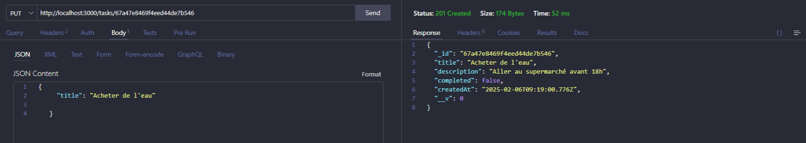

# Gestionnaire de Tâches

Ce projet est une application web simple pour gérer des tâches. Elle permet de créer, lire, mettre à jour et supprimer des tâches. L'application est construite avec Express.js et MongoDB pour la gestion des données.

## Fonctionnalités

- **Créer une tâche** : Ajouter une nouvelle tâche avec un titre et une description.
- **Lire les tâches** : Obtenir la liste de toutes les tâches ou une tâche spécifique par son ID.
- **Mettre à jour une tâche** : Modifier les détails d'une tâche existante.
- **Supprimer une tâche** : Supprimer une tâche de la base de données.

## Prérequis

Avant de commencer, assurez-vous d'avoir les éléments suivants installés sur votre machine :

- [Node.js](https://nodejs.org/) (version 16 ou supérieure)
- [MongoDB](https://www.mongodb.com/) (local ou via un service cloud comme MongoDB Atlas)

## Installation

1. Clonez le dépôt :

   ```bash
   git clone https://github.com/hayathdt/todo-manager.git
   cd todo-manager
   ```

## Installation des dépendances :

```bash
npm install
```

## Configuration de la base de données :

1. Créez un fichier `.env` à la racine du projet et définissez les variables d'environnement nécessaires. Vous pouvez utiliser un fichier `.env.example` comme modèle.
2. Configurez la connexion à votre base de données MongoDB.

## Démarrage de l'application :

```bash
npm start
```

L'application sera accessible à l'adresse `http://localhost:3000`.

# Utilisation de l'API

## Créer une tâche :

- **Méthode** : `POST`
- **URL** : `/tasks`
- **Corps de la requête** :
  ```json
  {
    "title":
    "description":
     "completed":
  }
  ```

## Lire les tâches :

- **Méthode** : `GET`
- **URL** : `/tasks`
- **Corps de la requête + réponse** :
  

## Lire une tâche spécifique :

- **Méthode** : `GET`
- \*\*URL: `/tasks/:id`
- **Paramètres de requête** :
- `id` : ID de la tâche à récupérer (facultatif)
  **Corps de la requête + réponse** :
  

## Mettre à jour une tâche :

- **Méthode** : `PUT`
- **URL** : `/tasks/:id`
- **Paramètres de requête** :
- `id` : ID de la tâche à mettre à jour
- **Corps de la requête + réponsé** :
  

## Supprimer une tâche :

**Méthode** : `DELETE`
**URL** : `/tasks/:id`
**Paramètres de requête** :
`id` : ID de la tâche à supprimer
**Corps de la requête** :


## Tests

Pour exécuter les tests, utilisez la commande suivante :

```bash
npm test


```
